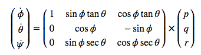
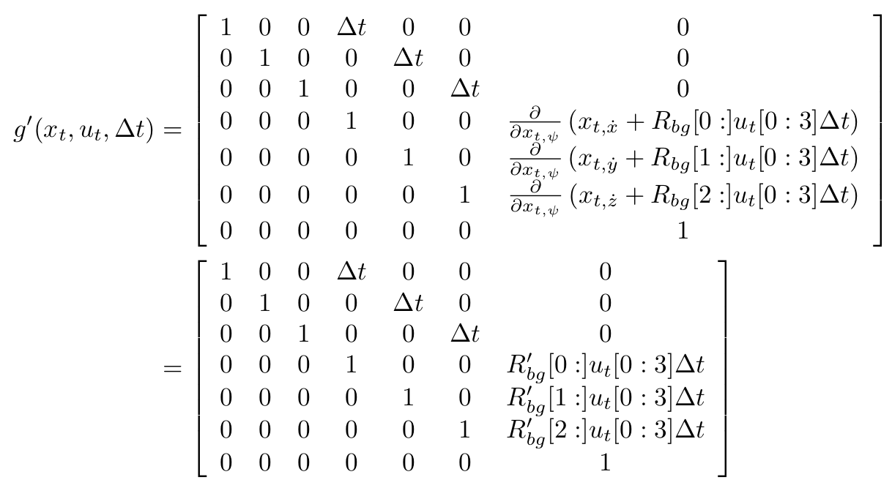

# Quadrotor Estimation

---

### Udacity Flying Car and Autonomous Flight Engineer Nanodegree

 - [Project Setup](#project-setup)
 - [Simulator Walkthrough](#simulator-walkthrough)
 - [Project Rubric](#project-rubric)
 - [Future Work](#future-work)

## Project Setup ##

This project will continue to use the C++ development environment you set up in the Controls C++ project.

 1. Clone this repository
 ```
 git clone https://github.com/wlsmith42/Quadrotor-Estimation.git
 ```

 2. Import the code into your IDE of choice like done in the [Controls C++ project](https://github.com/wlsmith42/Quadrotor-Controls#development-environment-setup)
 
 3. You should now be able to compile and run the estimation simulator just as you did in the controls project


## Simulator Walkthrough ##

Now that you have all the code on your computer and the simulator running, let's walk through some of the elements of the code and the simulator itself.

### The Code ###

- The EKF is implemented in `QuadEstimatorEKF.cpp`

- Parameters for tuning the EKF are in the parameter file `QuadEstimatorEKF.txt`

- When you turn on various sensors (the scenarios configure them, e.g. `Quad.Sensors += SimIMU, SimMag, SimGPS`), additional sensor plots will become available to see what the simulated sensors measure.

- The EKF implementation exposes both the estimated state and a number of additional variables. In particular:

   - `Quad.Est.E.X` is the error in estimated X position from true value.  More generally, the variables in `<vehicle>.Est.E.*` are relative errors, though some are combined errors (e.g. MaxEuler).

   - `Quad.Est.S.X` is the estimated standard deviation of the X state (that is, the square root of the appropriate diagonal variable in the covariance matrix). More generally, the variables in `<vehicle>.Est.S.*` are standard deviations calculated from the estimator state covariance matrix.

   - `Quad.Est.D` contains miscellaneous additional debug variables useful in diagnosing the filter. You may or might not find these useful but they were helpful to us in verifying the filter and may give you some ideas if you hit a block.


#### `config` Directory ####

In the `config` directory, in addition to finding the configuration files for your controller and your estimator, you will also see configuration files for each of the simulations.  This project uses simulations 06 through 11.

As an example, if we look through the configuration file for scenario 07, we see the following parameters controlling the sensor:

```
# Sensors
Quad.Sensors = SimIMU
# use a perfect IMU
SimIMU.AccelStd = 0,0,0
SimIMU.GyroStd = 0,0,0
```

This configuration tells us that the simulator is only using an IMU and the sensor data will have no noise.  You will notice that for each simulator these parameters will change slightly as additional sensors are being used and the noise behavior of the sensors change.


### The Simulator ###

In the simulator window itself, you can right click the window to select between a set of different scenarios that are designed to test the different parts of your controller.

The simulation (including visualization) is implemented in a single thread.  This is so that you can safely breakpoint code at any point and debug, without affecting any part of the simulation.

Due to deterministic timing and careful control over how the pseudo-random number generators are initialized and used, the simulation should be exactly repeatable. This means that any simulation with the same configuration should be exactly identical when run repeatedly or on different machines.

Vehicles are created and graphs are reset whenever a scenario is loaded. When a scenario is reset (due to an end condition such as time or user pressing the ‘R’ key), the config files are all re-read and state of the simulation/vehicles/graphs is reset -- however the number/name of vehicles and displayed graphs are left untouched.

When the simulation is running, you can use the arrow keys on your keyboard to impact forces on your drone to see how your controller reacts to outside forces being applied.

#### Keyboard / Mouse Controls ####

There are a handful of keyboard / mouse commands to help with the simulator itself, including applying external forces on your drone to see how your controllers reacts!

 - Left drag - rotate
 - X + left drag - pan
 - Z + left drag - zoom
 - arrow keys - apply external force
 - C - clear all graphs
 - R - reset simulation
 - Space - pause simulation

## Project Rubric ##

### Writeup
This README includes all the rubric points and how I addressed each one. 

### Implemented Controller

###### Determine the standard deviation of the measurement noise of both GPS X data and Accelerometer X data.

Based on the sensor data from scenario 6 - noisy sensors, I found the standard deviation of the measurement noise to be `0.7` for `MeasuredStdDev_GPSPosXY` and `0.5` for `MeasuredStdDev_AccelXY`.


###### Implement a better rate gyro attitude integration scheme in the UpdateFromIMU() function.

The following equation was used to improve the attitude filter: 

<p align="center">

</p>


The implementation of this equation can be seen in the code block below:

``` C++
float phi = rollEst;
float theta = pitchEst;
  
Mat3x3F M = Mat3x3F::Zeros();
M(0,0) = 1;
M(0,1) = sin(phi) * tan(theta);
M(0,2) = cos(phi) * tan(theta);
M(1,1) = cos(phi);
M(1,2) = -sin(phi);
M(2,1) = sin(phi) / cos(theta);
M(2,2) = cos(phi) / cos(theta);
  
V3F angle_dot = M * gyro;

float predictedPitch = pitchEst + dtIMU * angle_dot.y;
float predictedRoll = rollEst + dtIMU * angle_dot.x;
ekfState(6) +=  dtIMU * angle_dot.z;	// yaw

// normalize yaw to -pi .. pi
if (ekfState(6) > F_PI) ekfState(6) -= 2.f*F_PI;
if (ekfState(6) < -F_PI) ekfState(6) += 2.f*F_PI;
```

###### Implement all of the elements of the prediction step for the estimator.

My implementation of `PredictState()` incorporates time duration and an Attitude Quaternion to predict the current state forward in time using current accelerations and body rates. This can be seen in the code block below:

``` C++
V3F att = attitude.Rotate_BtoI(accel) + V3F(0,0,CONST_GRAVITY);
predictedState(0) += dt * curState(3);
predictedState(1) += dt * curState(4);
predictedState(2) += dt * curState(5);
predictedState(3) += dt * att.x;
predictedState(4) += dt * att.y;
predictedState(5) += dt * att.z;
```

The following equation was used to implement `GetRbgPrime()`:

<p align="center">

</p>

The implementation of this equation can be seen in the code block below:

``` C++
float sinTheta = sin(pitch);
float cosTheta = cos(pitch);
  
float sinPhi = sin(roll);
float cosPhi = cos(roll);
  
float sinPsi = sin(yaw);
float cosPsi = cos(yaw);
  
RbgPrime(0,0) = -cosTheta * sinPsi;
RbgPrime(0,1) = -sinPhi * sinTheta * sinPsi - cosTheta * cosPsi;
RbgPrime(0,2) = -cosPhi * sinTheta * sinPsi + sinPhi * cosPsi;
  
RbgPrime(1,0) = cosTheta * cosPsi;
RbgPrime(1,1) = sinPhi * sinTheta * cosPsi - cosPhi * sinPsi;
RbgPrime(1,2) = cosPhi * sinTheta * cosPsi + sinPhi * sinPsi;
```

The following equation was used to implement `Predict()`:

<p align="center">

</p>

The implementation of this equation can be seen in the code block below:

``` C++
gPrime(0,3) = dt;
gPrime(1,4) = dt;
gPrime(2,5) = dt;
  
gPrime(3,6) = (RbgPrime(0) * accel).sum() * dt;
gPrime(4,6) = (RbgPrime(1) * accel).sum() * dt;
gPrime(5,6) = (RbgPrime(2) * accel).sum() * dt;

ekfCov = gPrime * ekfCov * gPrime.transpose() + Q;
```

###### Implement the magnetometer update.

The following equation was used to implement `UpdateFromMag()`:

<p align="center">

</p>

The implementation of this equation can be seen in the code block below:

``` C++
float d = z(0) - ekfState(6);
  
if(d > F_PI) {
  z(0) -= 2.f * F_PI;
}
if(d < -F_PI) {
  z(0) += 2.f * F_PI;
}
  
zFromX(0) = ekfState(6);
hPrime(0,6) = 1;
```

###### Implement the GPS update.

The following equation was used to implement `UpdateFromGPS()`:

<p align="center">

</p>

The implementation of this equation can be seen in the code block below:

``` C++
for(int i=0; i<6; i++) {
  zFromX(i) = ekfState(i);
  hPrime(i,i) = 1.f;
}
```


### Flight Evaluation

My C++ controller is successfully able to fly the provided test trajectory and visually passes inspection of the scenarios leading up to the test trajectory. Each scenario's results are shown below:

###### Scenario 6 - Sensor Noise

<p align="center">

</p>

```
PASS: ABS(Quad.GPS.X-Quad.Pos.X) was less than MeasuredStdDev_GPSPosXY for 67% of the time
PASS: ABS(Quad.IMU.AX-0.000000) was less than MeasuredStdDev_AccelXY for 68% of the time
```

###### Scenario 7 - Attitude Estimation

<p align="center">

</p>

```
PASS: ABS(Quad.Est.E.MaxEuler) was less than 0.100000 for at least 3.000000 seconds
```

###### Scenario 8 - Predict State

<p align="center">

</p>


###### Scenario 9 - Predict Covariance

<p align="center">

</p>


###### Scenario 10 - Mag Update

<p align="center">

</p>

```
PASS: ABS(Quad.Est.E.Yaw) was less than 0.120000 for at least 10.000000 seconds
PASS: ABS(Quad.Est.E.Yaw-0.000000) was less than Quad.Est.S.Yaw for 71% of the time
```

###### Scenario 11 - GPS Update

<p align="center">

</p>

```
PASS: ABS(Quad.Est.E.Pos) was less than 1.000000 for at least 20.000000 seconds
```
